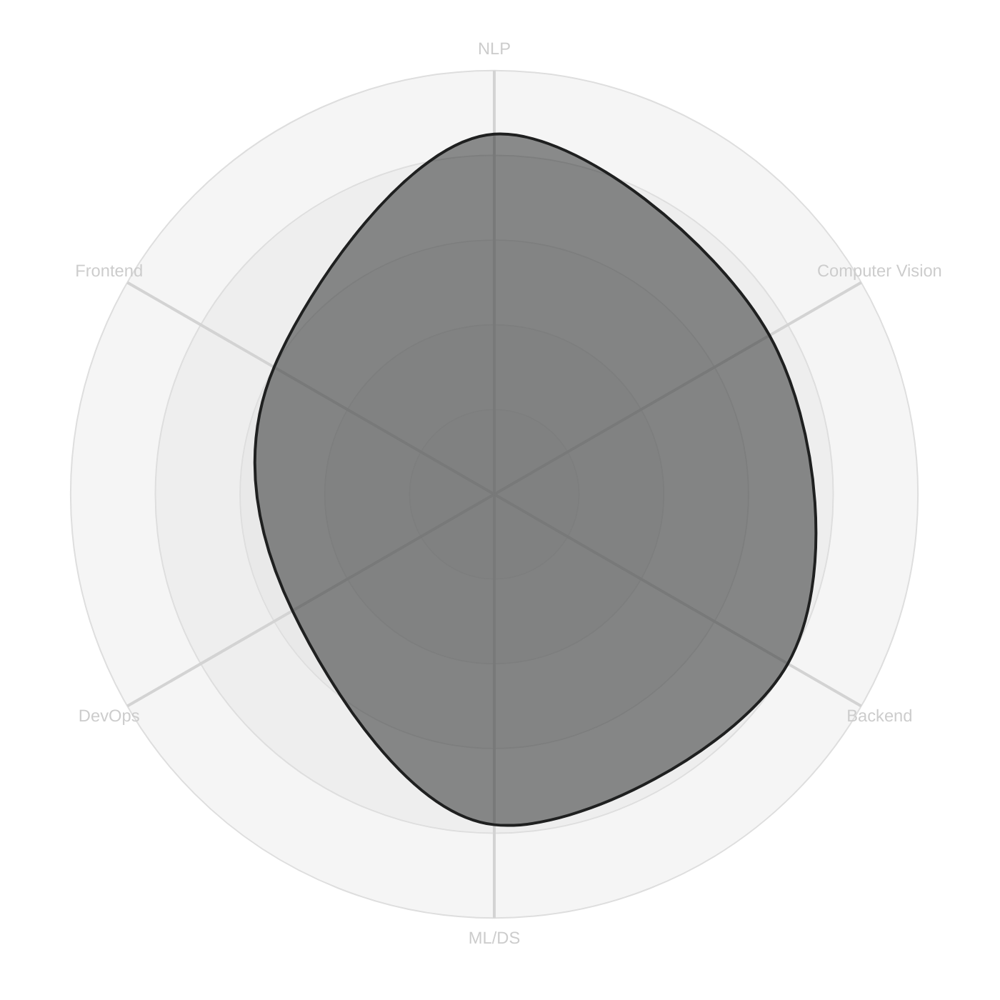

<div align="center">

```
$ whoami
```


```
$ cat status.log
```


</div>

<br>

<table>
<tr>
<td width="60%" valign="top">

### `~/about`

```
role         AI Systems Developer
education    B.Tech CS @ LPU
location     India
focus        NLP · Computer Vision · Full Stack
now_learning RAG, LangGraph, MLOps, Kubernetes
philosophy   build things that solve problems,
             not projects that fill a portfolio
```

</td>
<td width="40%" valign="top">

### `~/stack --list`


<br>


</td>
</tr>
</table>

---

### `~/projects --ls -la`

| # | name | type | stack |
|---|------|------|-------|
| 01 | **AI Document Classifier** | NLP pipeline | `Python` `NLP` |
| 02 | **Security Vulnerability Framework** | Cybersecurity sim | `Python` `Security` |
| 03 | **AQI Prediction** | Forecasting model | `Scikit-Learn` `Data` |
| 04 | **Diablo** | Voice assistant | `Python` `Automation` |
| 05 | **UrbanSight** | Computer vision | `OpenCV` `CV` |
| 06 | **Serenity** | Wellness chatbot | `Flask` `AI` |

<sub>Update the links below to point at each repo once pushed.</sub>
<br>
<a href="https://github.com/rattaneshguleria">01</a> ·
<a href="https://github.com/rattaneshguleria">02</a> ·
<a href="https://github.com/rattaneshguleria">03</a> ·
<a href="https://github.com/rattaneshguleria">04</a> ·
<a href="https://github.com/rattaneshguleria">05</a> ·
<a href="https://github.com/rattaneshguleria">06</a>

---

### `~/activity --live`

<!--START_SECTION:activity-->
<!-- This block is rewritten automatically by activity.yml — leave it empty, don't edit by hand -->
<!--END_SECTION:activity-->

---

### `~/metrics --render`

<sub>Everything below this line is a real SVG, computed fresh from the GitHub API by <code>lowlighter/metrics</code> running in Actions — not a static badge template. Regenerates daily.</sub>

<p align="center">
  
</p>

<details>
<summary><code>~/metrics --isocalendar --full-year</code></summary>
<br>
<p align="center">
  
</p>
</details>

<details>
<summary><code>~/metrics --habits</code> — coding hours/days breakdown</summary>
<br>
<p align="center">
  
</p>
</details>

<details>
<summary><code>~/contrib --snake</code></summary>
<br>
<picture>
  <source media="(prefers-color-scheme: dark)" srcset="https://raw.githubusercontent.com/rattaneshguleria/rattaneshguleria/output/github-snake-dark.svg" />
  <source media="(prefers-color-scheme: light)" srcset="https://raw.githubusercontent.com/rattaneshguleria/rattaneshguleria/output/github-snake.svg" />
  
</picture>
</details>

---

### `~/skills --radar`



---

<div align="center">

### `~/connect --socials`

<a href="YOUR_LINKEDIN_URL_HERE"></a>
<a href="YOUR_TWITTER_URL_HERE"></a>
<a href="mailto:YOUR_EMAIL_HERE"></a>

<sub>views: </sub>

```
$ exit
process finished with exit code 0
```

</div>
